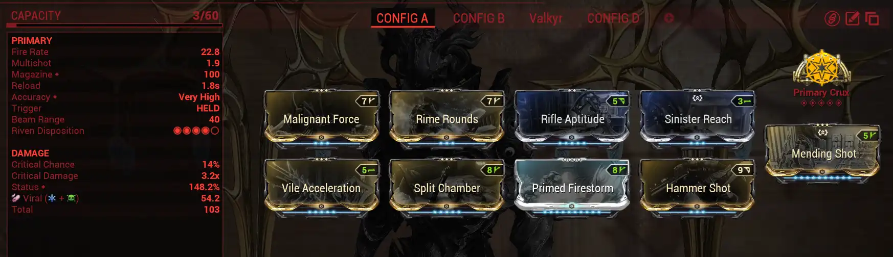
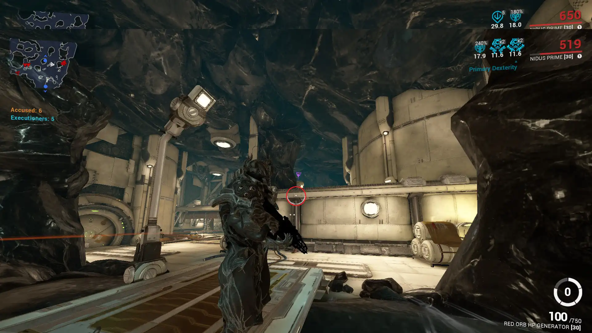

Index
Video - Coming soon

## Introduction

- Why is nidus fps dependant
- Who isn't recommended to play?
- Advice for beginners

## Settings/Loadout

Graphical settings
Loadout

- Build
- Glaxion vandal
- Akarius
- Praedos / Random weapon
- Archon shards

## Gameplay

What is larva / What does the augment do
Rollouts

- Praedos
- No praedos with Parkour shard
- No praedos No parkour shard
  Afk position
  Bridge position
  Bridge larva
- How to pop
- Position
- What if larva goes through
  Lake larva
- Position
- When to stop
- How to pop
- Is flick needed? NO
- Why is important for bridge larva
  Recommendations to pop
  How to reduce time in mission?
  Fixes
- Lamp
- Sight bottom/Ceiling
- L nekros mid air
- Big Fan
- Deep Platform

# Index

# Video - Coming soon

# Introduction

## Why is nidus fps dependant

Larva pull speed is based on the frames per second you have in game.

[https://youtu.be/FvC9bvZhUF4](https://youtu.be/FvC9bvZhUF4)

## Who isn't recommended to play?

**Recommended doesn't mean you can't try it out and make it work.**

- Players who's pc can't get more than ~90fps stable.
- Players who's pc has severe fps drops.

## Advice for beginners

Play slow and steady without rushing or spamming the larva button.

# Settings/Loadout

## Graphical settings

**Video**

- Max Framerate: UNLIMITED
- Field of view: 90
- Quality preset: LOW
- Texture memory: HIGH
- High Shader quality: ENABLED

**Accessibility**

- Visual Effects Intensity: 10
- Reduce Teammate Visual Effects: ENABLED
- Enable Screen Shake: DISABLED

**Sensitivity**
Recommended a relatively high sensitivity (If you are going to flick)
What i use:

- Look/Aim Sensitivity: 10
- Mouse DPI: 950

## Loadout

### Build

### Archon shards

### Glaxion vandal

### Akarius Prime

### Praedos / Random weapon

You only need attack speed mods to make the slam animation faster.
The random weapon to use its recommended to choose one with high base attack speed. Build can be the same as praedos.

# Gameplay

## What is larva

Larva is a **projectile** that once hitting a surface or manually stopped mid air will pull all visible enemies in a 33.60 meter radius.
Must know that **larva is casted and then ejected**. Meaning it will not get sent once you press the larva key.
[Larva Projectile](<https://youtu.be/7VaxpMrqtW0>)

## What does the augment do

Its augment lets us burst the larva which its used at rank 0.
Below its shown ways to burst the larva.
[Larva Pops](<https://youtu.be/FeWinBSm1ME>)

1. (Late pop) The first burst waiting for the enemies to be held by the larva.
2. (Timed pop) The second burst, popping the larva once enemies are close enough.
3. (Insta pop) The third burst, spamming to burst the larva no matter where enemies are.

## Larva position and Rollouts

To pull all enemies you need to be fast and relatively accurate, throwing the larva inside the following zone:

### Praedos

Pros: Closer to bridge, faster bullet jump, less inputs needed.
Cons: Relatively high chance for Garesh to teleport to you.

#### Initial Position

#### Rollout

[Praedos Rollout](<https://youtu.be/5zrumHz5d4A>)

### No praedos with Parkour shard

Pros: Bit behind praedos position, faster bullet jump, less inputs needed.
Cons: Similar or less chance than praedos for Garesh can teleport to you.

#### Initial Position

#### Rollout

[Fast Rollout](<https://youtu.be/RMSSlFHpev0>)

[Slow Rollout](<https://youtu.be/fsBbTE1XAQE>)

### No praedos No parkour shard

Pros: Little chance for Garesh to teleport to you. More inputs needed.
Cons: Way behind the above, normal bullet jump

#### Initial Position

#### Rollout

[Normal Rollout](<https://youtu.be/I5XZ-OfXY_I>)

### (Advanced rollout) No praedos No parkour shard

Pros: Remove slam animation
Cons: Very hard to pull off and can end up anywhere but bridge.
To pull this off, you need to be relatively close to the column and attack while crosshair is on the column. The game understand that you are slamming and it will glide you around the surface until finally reaching the floor.

#### Rollout

[Advanced Rollout](<https://youtu.be/oOR3MCnjif4>)

## Afk position

The usual position with resolution 16:9 is the following one:

If resolution 21:9:

If resolution 3x2 16:9:

## Bridge position

You always want to have the same position for each run.

## Bridge Larva

### Placement on rollout

**Note:** Just be aware of larva placement, don't bother with the rollout.
Firstly depends on your first larva throw, needing enough range to pull to bridge and need to __**be aware of dome placement**__ for enemies go get attached.

### Placement After rollout

**Depending on the cage placement you'd always want the larva to be totally or partially covered by the dome and as in the center as possible.**
🔴 = Khora
🔵 = Larva
🟢 = Nidus
🟡 = Dome

#### Dome on nidus and larva to feet

#### Dome on center, nidus next to stairs and larva to feet

#### Dome on center and larva between khora and nidus

### What if larva goes through the bridge?
There is no 100% known reason about why larva clips through the bridge.
Tip: Don't spam the larva and try throwing the larva on different zones of the bridge.

### How to pop
There are several ways to pop the larva on bridge.
1. (Late pop) Wait till the enemies are grouped on the larva.
2. (Timed pop) Wait 0.5s and then pop the larva.
3. (Insta pop) Spam the hell out of the larva key.

**I'd recommend using them according to your fps:**
***The recommendations below do not deny the use of the larva pops from above. Try everything and use what suits best for you!***
High FPS (above 300): Timed pop and Insta pop and use whatever suits you best.
Medium FPS (between 100-300): Mainly use Timed pop and casually Insta pop.
Low FPS (below 100): Late pop but try out Timed pop.

#### Footage 
>**Try to be aware of bridge pops and don't bother with the rest.**
[120Fps Timed pop run](<https://youtu.be/K--TCFZf2jU>)
[Locked 120Fps insta pop run](<https://youtu.be/pMytam2SuN8>)
[~300Fps run](<https://youtu.be/3upWUc4khPQ>)

## Lake larva
You want to pop the larva when enemies are inside or close to the imaginary circle.

### Position

### When to stop

### How to pop

### Is flick needed? NO

### Why is important for bridge larva

## Recommendations to pop

## How to reduce time in mission?

## Fixes

- Lamp
- Bridge
- L nekros mid air
- Sight bottom/Ceiling
- Big Fan
- Deep Platform
